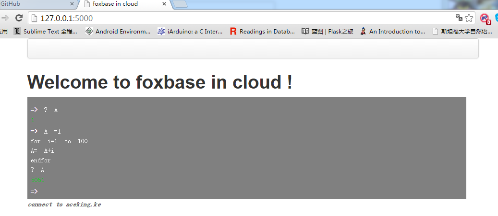

# FOXBASE IN CLOUD

## INSTALL

Use the rply for grammar build , and flask for the web 
 ```pip install -r requirements.txt```

 More information about rply, see [rply][1].
 
## RUN
 ``` python flask_app.py ```

## KEYWORDS
```DATE NUMBER IF ELSE ELSEIF ENDIF DO WHILE ENDDO CASE ENDCASE OTHERWISE EXIT FOR TO STEP EACH ENDFOR NEXT ACCEPT TO AND NOT OR LOOP```
## EXPRESSION
### Arithmetic expression

* ADD '+' such as `12+2`
* SUB
* MUL
* POWER
* DIV
* MOD
### relation expression
##  logic expression

## GRAMMAR

* print statement 

## SAMPLE 

* for statment
```
	A =1  
	for i=1 to 100  
	A= A+i 
	endfor
	? A
```
* while statment
```
A=1
DO while A < 50
A = A + A
enddo
? A
```


[1]: https://rply.readthedocs.io/